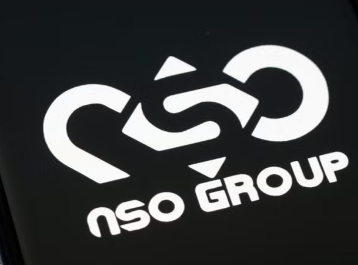

# NSO-GROUP
<div align="center">
 
```
███╗   ██╗███████╗ ██████╗      ██████╗ ██████╗  ██████╗ ██╗   ██╗██████╗ 
████╗  ██║██╔════╝██╔═══██╗    ██╔════╝ ██╔══██╗██╔═══██╗██║   ██║██╔══██╗
██╔██╗ ██║███████╗██║   ██║    ██║  ███╗██████╔╝██║   ██║██║   ██║██████╔╝
██║╚██╗██║╚════██║██║   ██║    ██║   ██║██╔══██╗██║   ██║██║   ██║██╔═══╝ 
██║ ╚████║███████║╚██████╔╝    ╚██████╔╝██║  ██║╚██████╔╝╚██████╔╝██║     
╚═╝  ╚═══╝╚══════╝ ╚═════╝      ╚═════╝ ╚═╝  ╚═╝ ╚═════╝  ╚═════╝ ╚═╝     
                 & PEGASUS SPYWARE — RESEARCH REPOSITORY
```
 

 
# 🕵️ NSO Group & Pegasus — Repositorio de Investigación
 
**Compilación técnica de documentos, análisis forense, registros de prensa y evidencia**  
**sobre el software espía Pegasus y su impacto en derechos humanos a nivel global.**
 
---
 
[](https://github.com/)
[](https://github.com/)
[](https://citizenlab.ca/)
[](https://amnesty.org/)
[](https://github.com/)
 
</div>
 
---
 
## ⚠️ Aviso legal
 
> Este repositorio tiene fines **exclusivamente educativos e investigativos**.  
> Toda la información aquí recopilada proviene de fuentes públicas, informes académicos,  
> investigaciones periodísticas y documentos oficiales de gobiernos y ONG.  
> No se distribuye ni se reproduce código malicioso de ningún tipo.
 
---
 
## 📑 Tabla de Contenidos
 
- [🏢 ¿Qué es NSO Group?](#-qué-es-nso-group)
- [📱 ¿Qué es Pegasus?](#-qué-es-pegasus)
- [⚔️ Vectores de Ataque](#️-vectores-de-ataque)
- [🌍 Impacto Global Documentado](#-impacto-global-documentado)
- [⚖️ Acciones Legales y Sanciones](#️-acciones-legales-y-sanciones)
- [🛠️ Recursos Técnicos](#️-recursos-técnicos-para-investigadores)
- [📚 Fuentes y Referencias](#-fuentes-y-referencias)
 
---
 
## 🏢 ¿Qué es NSO Group?
 
**NSO Group Technologies** es una empresa israelí de ciberinteligencia fundada en 2010 por:
 
| Fundador | Rol |
|----------|-----|
| **Niv Carmi** | Co-fundador |
| **Omri Lavie** | Co-fundador |
| **Shalev Hulio** | Co-fundador y ex-CEO |
 
La empresa afirma que sus herramientas están diseñadas para ayudar a **agencias gubernamentales** a combatir el terrorismo y el crimen organizado. Sin embargo, múltiples investigaciones independientes han documentado su uso sistemático contra periodistas, activistas y opositores políticos.
 
```
NSO Group afirma:          Investigaciones documentan:
─────────────────          ──────────────────────────
Combatir terrorismo    →   Espionaje a periodistas
Prevenir crimen        →   Vigilancia de activistas
Solo clientes gov.     →   Uso contra sociedad civil
```
 
---
 
## 📱 ¿Qué es Pegasus?
 
**Pegasus** es el software espía más sofisticado documentado públicamente. Permite vigilancia remota y total de cualquier smartphone sin conocimiento del objetivo.
 
### Capacidades de vigilancia
 
```
DISPOSITIVO INFECTADO CON PEGASUS
┌─────────────────────────────────────────────────────┐
│                                                      │
│  📨 Mensajes (SMS, WhatsApp, Signal, Telegram)      │
│  📧 Correos electrónicos                            │
│  📸 Fotos y archivos almacenados                    │
│  🎙️ Micrófono (activación remota encubierta)       │
│  📷 Cámara (activación remota encubierta)           │
│  📍 Ubicación GPS en tiempo real                    │
│  📞 Llamadas (grabación y metadatos)                │
│  👥 Contactos y agenda                              │
│  🔑 Contraseñas y tokens de sesión                  │
│                                                      │
└─────────────────────────────────────────────────────┘
         ↑↑↑ TODO enviado al operador sin rastro ↑↑↑
```
 
---
 
## ⚔️ Vectores de Ataque
 
### Evolución técnica de Pegasus
 
| Generación | Vector | Interacción requerida | Detección |
|------------|--------|----------------------|-----------|
| **v1** | Phishing por SMS/enlace | ✅ Click del usuario | Media |
| **v2** | Exploits en apps (WhatsApp) | ⚠️ Llamada perdida | Baja |
| **v3 — Zero Click** | Vulnerabilidades silenciosas | ❌ Ninguna | Muy baja |
| **v4 — Network Injection** | Inyección de red en tráfico HTTP | ❌ Ninguna | Casi nula |
 
### Exploits documentados en WhatsApp
 
```
OPERACIÓN HUMMINGBIRD — Vectores de WhatsApp:
 
  Heaven  ──→  Vector inicial de entrega del payload
     ↓
  Eden    ──→  Escalación de privilegios en el dispositivo
     ↓
  Erised  ──→  Extracción de datos y persistencia oculta
 
  Método: Ingeniería inversa de servidores de WhatsApp
  para inyectar malware mediante videollamadas.
```
 
---
 
## 🌍 Impacto Global Documentado
 

 
---
 
### Casos por región
 
<details>
<summary><b>🇲🇦 Marruecos</b></summary>
 
- **Víctima:** Omar Radi, periodista de investigación
- **Método:** Inyección de red — infección sin click del usuario
- **Hallazgo:** El ataque ocurrió **después** de que NSO firmara compromisos de derechos humanos
- **Fuente:** Amnistía Internacional, 2020
 
</details>
 
<details>
<summary><b>🇲🇽 México y 🇵🇦 Panamá</b></summary>
 
- **Caso oficial:** Rastreo de Joaquín "El Chapo" Guzmán
- **Casos documentados de abuso:**
  - Activistas de salud pública vigilados
  - Periodista **Rafael Cabrera** espiado
- **Hallazgo:** Uso indiscriminado más allá del objetivo declarado
 
</details>
 
<details>
<summary><b>🇨🇴 Colombia</b></summary>
 
- Representantes de NSO confirmaron transacciones con el gobierno colombiano
- No existen registros oficiales públicos de la compra
- Sujeto a investigación periodística activa
 
</details>
 
<details>
<summary><b>🌐 Otros países documentados</b></summary>
 
| País | Objetivo | Evidencia |
|------|----------|-----------|
| 🇸🇦 Arabia Saudita | Círculo cercano a Jamal Khashoggi | Citizen Lab / Amnistía |
| 🇦🇪 Emiratos Árabes | Disidentes y activistas | Citizen Lab |
| 🇮🇳 India | Periodistas y políticos | WhatsApp lawsuit |
| 🇪🇸 España | Independentistas catalanes | Citizen Lab — "CatalanGate" |
| 🌍 +45 países | Sociedad civil | Citizen Lab global tracking |
 
</details>
 
---
 
## ⚖️ Acciones Legales y Sanciones
 
### 1. 🇺🇸 Entity List — Departamento de Comercio de EE. UU. (2021)
 
```
ENTIDADES SANCIONADAS:
┌────────────────────────┬──────────────┬─────────────────────────────────────┐
│ Entidad                │ País         │ Motivo                              │
├────────────────────────┼──────────────┼─────────────────────────────────────┤
│ NSO Group              │ 🇮🇱 Israel   │ Spyware para represión transnacional │
│ Candiru                │ 🇮🇱 Israel   │ Vigilancia de periodistas y diplomát.│
│ Positive Technologies  │ 🇷🇺 Rusia    │ Herramientas de acceso no autorizado │
└────────────────────────┴──────────────┴─────────────────────────────────────┘
Consecuencia: Restricción de exportaciones y acceso a tecnología estadounidense.
```
 
### 2. ⚖️ Demanda de WhatsApp / Meta (2019)
 
- **Hecho:** Pegasus explotó la función de videollamadas de WhatsApp
- **Víctimas confirmadas:** **1,400 usuarios** en 20 países, incluyendo 100 defensores de DDHH
- **Revelación clave:** Documentos judiciales mostraron que **NSO controlaba directamente** la recuperación de datos — contradiciendo su defensa de "solo vender herramientas"
- **Estado:** Caso activo. Veredicto significativo en 2024 en favor de Meta
 
### 3. 🍎 Demanda de Apple (2021)
 
- Apple demandó para prohibir a NSO el uso de sus productos y servicios
- Notificó a todos los usuarios afectados en más de 150 países
- Solicitó daños y perjuicios permanentes
 
---
 
## 🛠️ Recursos Técnicos para Investigadores
 
> ⚠️ Esta información es pública y proviene de investigaciones forenses publicadas por Citizen Lab y Amnistía Internacional.
 
### Infraestructura detectada
 
```bash
# Dominios asociados a infraestructura de C2 de Pegasus
sip.nsogroup.com
# IPs vinculadas a ataques documentados via WhatsApp
# Ver: Citizen Lab "Hide and Seek" report (2018)
```
 
### Nombres clave de exploits documentados
 
| Nombre | Función documentada | Aplicación objetivo |
|--------|--------------------|--------------------|
| `Heaven` | Vector de entrega inicial | WhatsApp |
| `Eden` | Escalación de privilegios | WhatsApp / iOS |
| `Erised` | Persistencia y exfiltración | WhatsApp / iOS |
| `FORCEDENTRY` | Zero-click vía iMessage | iOS — NSO / Pegasus |
| `KISMET` | Zero-click vía iMessage (2020) | iOS |
 
### Herramientas de detección forense (MVT)
 
```bash
# Mobile Verification Toolkit — desarrollado por Amnistía Internacional
# Detecta indicadores de compromiso de Pegasus en dispositivos
 
pip install mvt
 
# Análisis de backup de iOS
mvt-ios check-backup --iocs pegasus.stix2 /path/to/backup
 
# Análisis de dispositivo Android
mvt-android check-adb --iocs pegasus.stix2
```
 
> 🔗 Repositorio oficial: [github.com/mvt-project/mvt](https://github.com/mvt-project/mvt)
 
### Distinción importante
 
```
NSO Group  ≠  Cisco NSO
─────────────────────────────────────────────────────────
NSO Group       →  Empresa israelí · Software espía Pegasus
Cisco NSO (NSO) →  Network Services Orchestrator · Automatización de redes legítima
```
 
---
 
## 📚 Fuentes y Referencias
 
| Fuente | Tipo | Enlace |
|--------|------|--------|
| **Citizen Lab** | Análisis forense técnico | [citizenlab.ca](https://citizenlab.ca/) |
| **Amnistía Internacional** | Investigación de DDHH + MVT | [amnesty.org](https://amnesty.org/) |
| **U.S. Dept. of Commerce** | Decisiones oficiales Entity List | [commerce.gov](https://commerce.gov/) |
| **Forbidden Stories** | Proyecto Pegasus (17 medios) | [forbiddenstories.org](https://forbiddenstories.org/) |
| **The Guardian** | Cobertura investigativa global | [theguardian.com](https://theguardian.com/) |
| **WhatsApp v. NSO Group** | Documentos judiciales | USDC N.D. Cal. 4:19-cv-07123 |
 
---
 
## 📌 Línea de tiempo clave
 
```
2010  ──→  Fundación de NSO Group (Israel)
2016  ──→  Citizen Lab documenta Pegasus por primera vez (Ahmed Mansoor)
2019  ──→  WhatsApp/Meta demanda a NSO · 1,400 víctimas confirmadas
2020  ──→  Amnistía documenta ataque a Omar Radi en Marruecos
2021  ──→  NSO incluida en Entity List de EE. UU.
2021  ──→  Apple demanda a NSO · Notifica a usuarios en 150+ países
2021  ──→  Proyecto Pegasus — consorcio de 17 medios globales
2022  ──→  "CatalanGate" — espionaje al movimiento independentista catalán
2024  ──→  Veredicto judicial favorable a Meta/WhatsApp
2025+ ──→  Investigaciones activas en múltiples jurisdicciones
```
 
---
 
<div align="center">
 
**Este repositorio es mantenido con fines de investigación académica y seguridad**
 
[](https://citizenlab.ca/)
[](https://amnesty.org/en/tech/)
 
*Repositorio de investigación en ciberseguridad y derechos digitales · 2026*
 
</div>
